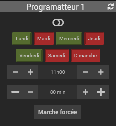
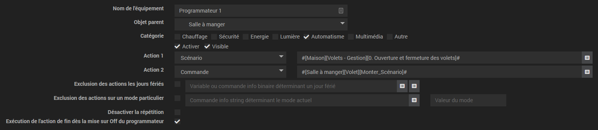

<a href="../../../{{site.baseurl}}/{{page.pluginId}}/{{page.lang}}">Plugin {{page.pluginId}}</a>

Présentation 
===
Plugin permettant d'ajouter un programmateur pour une commande.

Configuration
===
Aucun paramètre au niveau du plugin.

Une fois le plugin installé, vous pouvez ajouter directement un équipement dans le menu habituel.

Le paramétrage est le suivant :
- Spécification de l'action 1 à exécuter : d'abord dans le menu déroulant : commande ou scénario puis séléction de la commande ou du scénario dans la case qui apparaît alors.
- Optionnel : Spécification l'action 2 à exécuter : d'abord dans le menu déroulant : commande ou scénario puis séléction de la commande ou du scénario dans la case qui apparaît alors.
*Note : si le timer est à 0 minute : la commande ne sera pas exécutée*
- Optionnel : Exlusion des jours fériés : pour se faire, cocher la case et spécifier une variable ou une information binaire avertissant du jour férié : 1 = jour férié / 0 = jour standard.
- Optionnel : Exclusion des jours sur un mode particulier : pour se faire, cocher la case et spécifier une information string de mode ainsi que le nom du mode à exclure.
- Optionnel : Désactivation de la répétition : si vous cochez la case, la programmation ne se déclenchera qu'une seule fois. Elle se rééxécutera ensuite uniquement s'il y a une modification sur l'équipement (choix des jours / modification de l'heure ou de la durée).

Utilisation
===
Une fois les informations renseignées, vous pouverez directement aller sur le dashboard pour configurer le plugin.
Il présente :
- un bouton pour l'activer / le désactiver
- une case à cocher par jour (L/Ma/Me/J/V/S/D)
- des boutons +/- pour régler l'heure et les minutes du déclenchement.
- des boutons +/- pour régler la durée en minutes avant l'exécutioner de la seconde commande.
Notez que pour ce dernier, des options sont disponibles dans le paramétrage optionnel du widget associé :
  - step : par défaut renseigné à 10 : il s'agit du nombre de minutes desquelles sera décrémenter / incrémenter la durée de fonctionnement.
  - big_change : par défaut renseigné à Oui : permet l'affichage de boutons +/- complémentaires permettant de décrémenter / incrémenter par tranche de 60min la durée de fonctionnement.

Fonctionnement
===
A chaque mise à jour d'un des paramètres du plugin au niveau du widget :
- L'ensemble des futures programmations de l'action 1 est supprimée.
- Une nouvelle analyse est réalisée avec éventuellement la programmation de l'action 1.

A l'exécution de l'action 1 :
- L'ensemble des futures programmations de l'action 2 est supprimée.
- Une nouvelle analyse est réalisée avec éventuellement la programmation de l'action 2 sur la base des informations renseignées au moment de l'action 1.

Si le compteur est positif :
- L'action 1 est déclenchée à l'heure indiquée
- L'action 2 est déclenchée à l'heure indiquée + durée

Si le compteur est négatif :
- L'action 1 est déclenchée à l'heure indiquée - durée
- L'action 2 est déclenchée à l'heure indiquée

Changelog
===
[Lien vers le changelog]({{site.baseurl}}/{{page.pluginId}}/{{page.lang}}/changelog)
